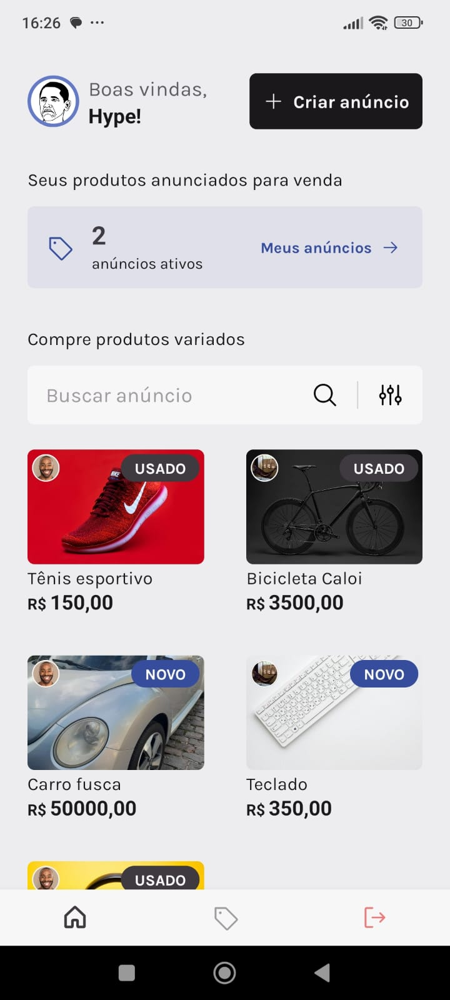
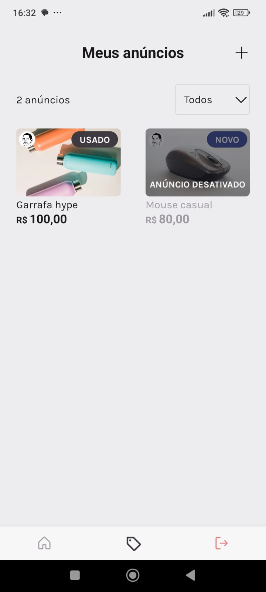
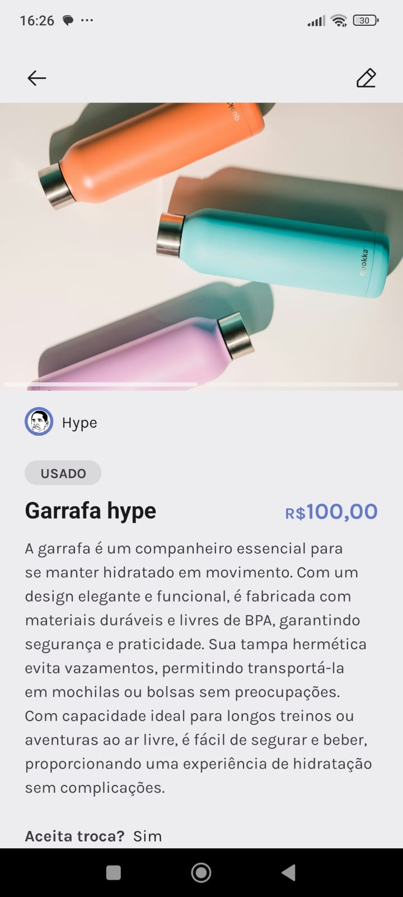
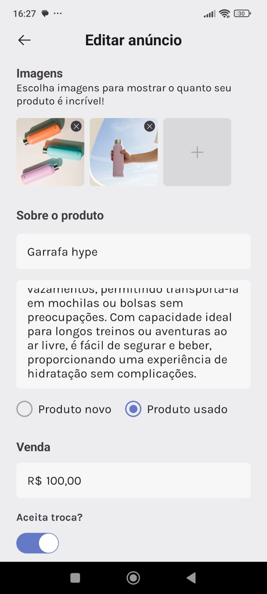

<h1 align="center">MarketSpace</h1>

The MarketSpace app was created with the aim of understanding more about navigation with public and private routes, styling with component libraries, consumption of APIs and refresh tokens, API contexts and form validation and control in React Native. MarketSpace is an app where people can publish products/advertisements that they want to sell. During the development of the app, we sought to keep the code as clean as possible and follow the best possible rules.;

 

# 🚀 Technologies

Project developed with the technologies:

- React Native
- TypeScript
- Native Base
- React Navigation
- Async Storage
- Expo
- Image Picker
- React Hook Form
- Yup
- Axios
- Git e Github
- Figma

 

# 💻 Issues

- Develop screen stylization
- Create navigation between screens with react navigation
- Consume the API and understand the routes
- Perform Refresh Token logic for user authentication
- Capture image from user gallery
- Validate form

  

<h2>Mobile Version:</h2>

### Home Screen
On this screen, the user can access actions to create a new advert and view products from other users of the application.

  

 

### My Adverts Screen
On this screen, the user can only have greater access to their adverts. This screen will contain only the active and inactive products created by the logged in user.

  

 

### Screen of Advert Details
On this screen, the user can have greater access to a specific product, being able to edit this product, deactivate or activate and delete the product in focus.

  

 

### Form Screen
The form screen's main functionality is two actions, creating a new ad or editing an existing ad. There the user can add and delete images of their product as well as other important information for the sale.

  

 

### Advert Preview Screen
This screen is important to show the ad creator how the application will be shown to other users who will see the product for sale.

  

